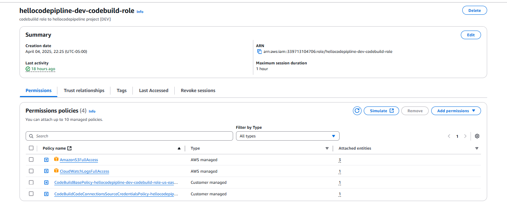
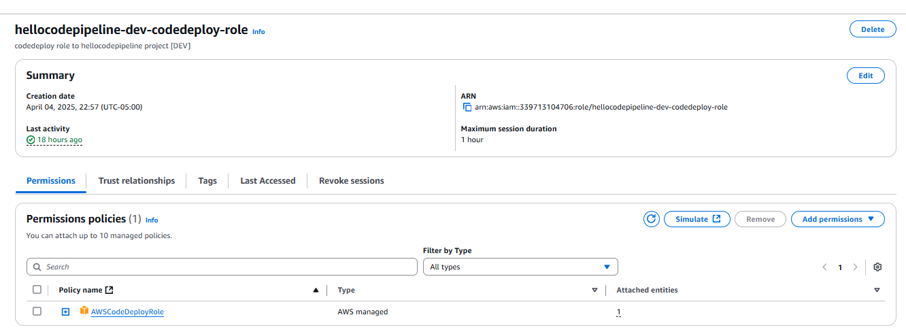
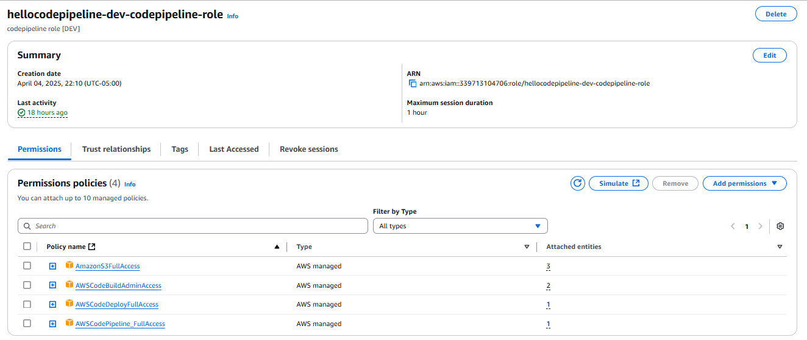

# 🚀 HelloCodePipeline

## 📌 Descripción

Este proyecto tiene como objetivo practicar e implementar un flujo CI/CD utilizando servicios de AWS. El despliegue se realiza automáticamente sobre una instancia EC2, aplicando buenas prácticas de infraestructura y automatización.

---

## ⚙️ Tecnologías y Servicios Utilizados

- **Java 17 (Amazon Corretto)**
- **Gradle**
- **Spring Boot**
- **Swagger / OpenAPI**

- **AWS CodePipeline**: Orquesta el flujo de CI/CD.
- **AWS CodeBuild**: Compila el proyecto y genera artefactos.
- **AWS CodeDeploy**: Realiza el despliegue en la instancia EC2.
- **Amazon S3**: Almacena los artefactos generados por CodeBuild.
- **Amazon EC2**: Entorno donde corre la aplicación.

---

## 🧱 Arquitectura de CI/CD en el proyecto

```bash
deploy/
└── dev/
├── buildspec.yml       # Instrucciones de build para CodeBuild
├── appspec.yml         # Instrucciones de despliegue para CodeDeploy
├── config/             # Archivos de configuración (opcional)
├── envs/               # Variables de entorno por ambiente
└── scripts/            # Scripts para preparar e iniciar la aplicación
```

Esta estructura permite replicar entornos (\`dev\`, \`staging\`, \`prod\`, etc.) de manera sencilla.

---

## 🔐 Buenas Prácticas Aplicadas

- Roles IAM separados para cada servicio (EC2, CodeBuild, CodeDeploy, CodePipeline).
- Políticas de permisos limitadas y específicas para el bucket de S3.
- Instalación del agente de CodeDeploy y JDK 17 en EC2.
- Se evita asignar permisos manualmente durante la ejecución.

---

## 🔐 Roles IAM y Política del Bucket S3

### Roles IAM Utilizados

Se crearon roles separados para cada servicio involucrado en el pipeline CI/CD, siguiendo el principio de **mínimos privilegios**:

#### 🔸 Rol para EC2
Permite a la instancia EC2 acceder a S3 para descargar artefactos y comunicarse con CodeDeploy.


#### 🔸 Rol para CodeBuild
Permite construir el proyecto, interactuar con S3 y enviar logs a CloudWatch.



#### 🔸 Rol para CodeDeploy
Permite administrar despliegues y notificar estados del proceso.



#### 🔸 Rol para CodePipeline
Permite orquestar el flujo de CI/CD y ejecutar acciones entre servicios.



#### 🔸 Politica del bucket
```json
{
  "Version": "2012-10-17",
  "Statement": [
    {
      "Sid": "AllowCIServiceRolesAccess",
      "Effect": "Allow",
      "Principal": {
        "AWS": [
          "arn:aws:iam::339713104706:role/hellocodepipline-dev-codebuild-role",
          "arn:aws:iam::339713104706:role/hellocodepipeline-dev-codedeploy-role",
          "arn:aws:iam::339713104706:role/hellocodepipeline-dev-codepipeline-role",
          "arn:aws:iam::339713104706:role/hellocodepipline-dev-ec2-role"
        ]
      },
      "Action": [
        "s3:GetObject",
        "s3:PutObject",
        "s3:ListBucket"
      ],
      "Resource": [
        "arn:aws:s3:::hellocodepipeline-dev-s3",
        "arn:aws:s3:::hellocodepipeline-dev-s3/*"
      ]
    }
  ]
}
```


## 🌐 API y Documentación

La API expone dos endpoints de ejemplo, y se encuentra documentada con Swagger.

- **URL Base:** \`http://<IP_EC2>:8080\`
- **Swagger UI:** \`http://<IP_EC2>:8080/swagger-ui.html\`

> ⚠️ Recuerda abrir el puerto 8080 en el grupo de seguridad de tu instancia EC2.

---

## ✅ Prerrequisitos

Antes de ejecutar el pipeline, asegúrate de tener lo siguiente configurado:

- Una instancia EC2 con:
    - **JDK 17 (Amazon Corretto)** instalado
      ```bash
      sudo yum update -y
      sudo amazon-linux-extras enable corretto17
      sudo yum install java-17-amazon-corretto -y
      java -version
      ```
    - **Agente de AWS CodeDeploy** instalado y en ejecución
      ```bash
      sudo yum update -y
      sudo yum install ruby wget -y
      cd /home/ec2-user
      wget https://aws-codedeploy-us-east-1.s3.us-east-1.amazonaws.com/latest/install
      chmod +x ./install
      sudo ./install auto
      sudo systemctl start codedeploy-agent
      sudo systemctl enable codedeploy-agent
      sudo systemctl status codedeploy-agent
      ```

- Bucket S3 configurado para almacenar artefactos

- Roles IAM configurados:
    - Rol para EC2 con permisos para CodeDeploy y acceso de solo lectura a S3
    - Rol para CodeBuild con permisos para S3 y CloudWatch Logs
    - Rol para CodeDeploy con permisos para manejar EC2 y despliegues
    - Rol para CodePipeline para orquestar las acciones entre servicios

- VPC por defecto habilitada


---

## 🛠️ Despliegue

1. **Subir el código a un repositorio (GitHub o CodeCommit)**
2. **Crear el pipeline en CodePipeline**
    - Fuente: GitHub o CodeCommit
    - Fase de build: CodeBuild usando \`buildspec.yml\`
    - Fase de despliegue: CodeDeploy usando \`appspec.yml\`

3. **Verificar que el agente de CodeDeploy esté en ejecución** en la EC2:

```bash
sudo service codedeploy-agent status
```

4. **Acceder a la aplicación**:

```
http://<IP_EC2>:8080/swagger-ui.html
```

---

## 📌 Notas Adicionales

- Puedes escalar este proyecto fácilmente para múltiples entornos duplicando la carpeta \`dev\` y adaptando \`appspec.yml\`, \`buildspec.yml\` y variables de entorno.
- Revisa los logs de CodeBuild y CodeDeploy en caso de fallos para depurar el proceso de CI/CD.